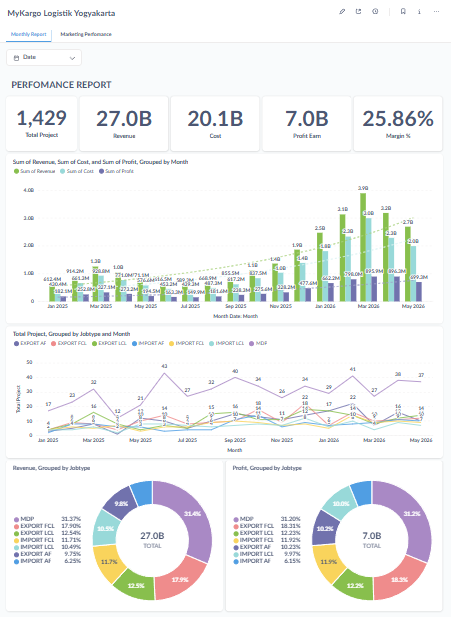
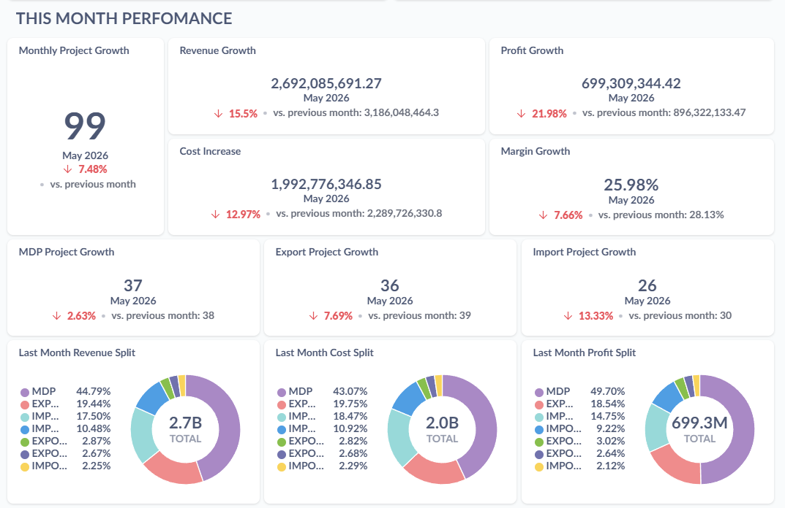
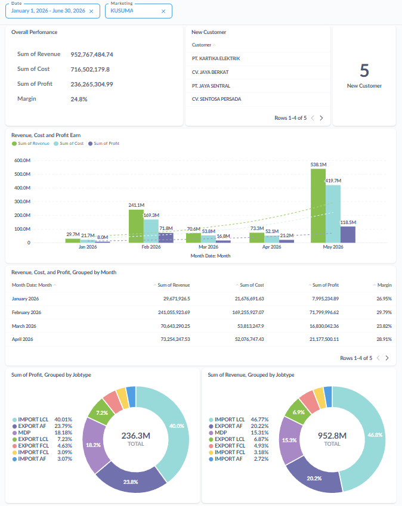
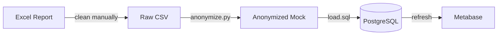

# MyCargoLogistik

> Monthly logistics performance dashboard — Excel → PostgreSQL → Metabase


---

## Dashboard Preview

### Overall Performance
Revenue, cost, profit & margin trends, jobtype distribution, month-over-month growth, and customer KPIs.

[](metabase/MyKargo%20Logistik%20Yogyakarta.pdf)

### This Month Snapshot
Current period KPIs at a glance — revenue, margin, top customers, and MKT ranking.

[](metabase/MyKargo%20Logistik%20Yogyakarta.pdf)

### Marketing Performance
Per-salesperson (MKT) tracking — revenue contribution, margin performance, and customer count by month.

[](metabase/MyKargo%20Logistik%20Yogyakarta%20Marketing%20Perfomance.pdf)

> Click any image to open the full PDF export from Metabase.

---

## Data Model

| Column | Type | Description |
|---|---|---|
| `id` | SERIAL | Primary key |
| `month` | DATE | Transaction month |
| `jobtype` | VARCHAR(50) | Export / Import / Domestic |
| `jobfile` | VARCHAR(100) | Unique job reference |
| `customer` | VARCHAR(200) | Company name |
| `mkt` | VARCHAR(100) | Salesperson |
| `revenue` | NUMERIC(15,2) | Gross revenue |
| `cost` | NUMERIC(15,2) | Operational cost |
| `profit` | NUMERIC(15,2) | Revenue - cost |
| `margin` | NUMERIC(10,4) | Profit / revenue % |
| `newcustomer` | VARCHAR(20) | REGULAR or NEW |

---

## Project Structure

```
├── data/
│   └── ReportProject2025database_mock.csv   # Anonymized sample data (1,429 rows)
├── sql/
│   └── schema.sql                           # monthly_reports table DDL
├── scripts/
│   ├── load.sql                             # \copy into PostgreSQL
│   └── anonymize.py                         # Generate mock from real data
├── metabase/
│   ├── overallperfomance.png                # Dashboard screenshot — overall
│   ├── thismonthperfomance.png              # Dashboard screenshot — monthly
│   ├── marketingperfomance.png              # Dashboard screenshot — MKT
│   ├── MyKargo Logistik Yogyakarta.pdf      # PDF export — overall dashboard
│   └── MyKargo Logistik Yogyakarta Marketing Perfomance.pdf  # PDF — MKT dashboard
├── .env.example                             # PostgreSQL connection template
├── .gitignore
└── README.md
```

---

## Setup

### 1. Create the database & table

```bash
createdb mycargologistik
psql -U postgres -d mycargologistik -f sql/schema.sql
```

### 2. Load sample data

```bash
psql -U postgres -d mycargologistik -f scripts/load.sql
```

### 3. Connect Metabase

1. Start Metabase and navigate to **Settings → Admin → Databases**
2. Add a new PostgreSQL connection using your credentials from `.env.example`
3. Build dashboards on top of `monthly_reports`

---

## Monthly Update Workflow



1. Place the new raw monthly CSV at `data/ReportProject2025database.csv`
2. Run `python3 anonymize.py` to generate an anonymized mock
3. Run `psql -U postgres -d mycargologistik -f scripts/load.sql`
4. Refresh your Metabase dashboards

---

## Anonymization Details

The mock data is generated by `anonymize.py` from the original company CSV and includes built-in realism:

| Feature | Detail |
|---|---|
| **Customer pool** | 180 unique names, **2 whales** → ~80% of total revenue |
| **Salespeople (MKT)** | 9 names in 3 tiers: 2 overperform, 3 normal, 4 underperform |
| **Jobtype mix** | ~40% Export, ~25% Import, ~35% Other |
| **Seasonality** | Q1↑, Q2↓, Q3→↑, Q4↑↑ (compound with overall growth) |
| **MoM growth** | Random base growth with ±20% jitter |
| **Target margin** | ~24% across all rows |
| **Whale assignment** | 80% of monthly revenue from 2 customers |
| **Row count** | ~2× the original data (±random jitter) |

---

## Tech Stack

- **Data cleaning** — Microsoft Excel
- **Database** — PostgreSQL
- **Visualization** — Metabase
- **Anonymization** — Python 3 (stdlib only)
